# Odoo Brain

This vault organizes the Odoo 19 documentation as an Obsidian-style knowledge graph.

## Start here
- [OpenClaw](brain/openclaw.md)
- [HF Training Status (2026-04-18)](brain/hf_training_status_2026-04-18.md)
- [Training Status](training/TRAINING_READY.md)
- [Training Script Inventory](training/03-training-script-inventory.md)
- [Vault token operations](runbooks/vault-token-operations.md)
- [Architecture Overview](brain/architecture_overview.md)
- [Platform](brain/platform.md)
- [Odoo 19 Compatibility Notes](brain/odoo19_differences.md)
- [Odoo 19 `res.config.settings`](brain/odoo19_res_config_settings.md)
- [Environment State Model](brain/environment_state_model.md)
- [Delivery](brain/delivery.md)
- [Stack Topology](brain/stack_topology.md)
- [Future Control Plane](brain/future_control_plane.md)

## Entry points
- [OpenClaw](brain/openclaw.md)
- [HF Training Status (2026-04-18)](brain/hf_training_status_2026-04-18.md)
- [Training Status](training/TRAINING_READY.md)
- [Training Script Inventory](training/03-training-script-inventory.md)
- [Vault token operations](runbooks/vault-token-operations.md)
- [Architecture Overview](brain/architecture_overview.md)
- [Platform](brain/platform.md)
- [Odoo 19 Compatibility Notes](brain/odoo19_differences.md)
- [Odoo 19 `res.config.settings`](brain/odoo19_res_config_settings.md)
- [Environment State Model](brain/environment_state_model.md)
- [Platform Bootstrap Status](brain/platform_bootstrap_status.md)
- [Delivery](brain/delivery.md)
- [Stack Topology](brain/stack_topology.md)
- [Future Control Plane](brain/future_control_plane.md)
- [Portainer](brain/portainer.md)
- [Portainer Workflow](brain/portainer_workflow.md)
- [Lobby](brain/lobby.md)
- [Control Plane](brain/control_plane.md)
- [Daily Checklist](brain/daily_checklist.md)
- [Services](brain/services.md)
- [Base](brain/base.md)
- [CRM](brain/crm.md)
- [Schema Atlas](brain/schema.md)
- [Operations](brain/operations.md)

## Graph

```mermaid
graph TD
  Home[Odoo Brain] --> Platform[Platform]
  Home --> HFTrainingStatus[HF Training Status]
  Home --> Odoo19Compat[Odoo 19 Compatibility Notes]
  Home --> ResConfig[Odoo 19 res.config.settings]
  Home --> EnvModel[Environment State Model]
  Home --> Bootstrap[Platform Bootstrap Status]
  Home --> Checklist[Daily Checklist]
  Home --> Portainer[Portainer]
  Home --> PortainerWorkflow[Portainer Workflow]
  Home --> Lobby[Lobby]
  Home --> ControlPlane[Control Plane]
  Home --> ArchitectureOverview[Architecture Overview]
  Home --> Topology[Stack Topology]
  Home --> Services[Services]
  Home --> Delivery[Delivery]
  Home --> Base[Base]
  Home --> CRM[CRM]
  Home --> Schema[Schema Atlas]
  Home --> Ops[Operations]
  Platform --> Bootstrap
  Platform --> EnvModel
  Platform --> Services
  Platform --> Checklist
  Platform --> Portainer
  Platform --> PortainerWorkflow
  Platform --> ArchitectureOverview
  Platform --> Topology
  Odoo19Compat --> ResConfig
  Bootstrap --> Delivery
  Bootstrap --> Ops
  Base --> BaseDoc[base_module.md]
  Base --> Compare[base_vs_crm.md]
  CRM --> CRMDoc[crm_module.md]
  CRM --> Compare
  Schema --> Catalog[deduplicated_tables.md]
  Schema --> ERD[erd.md]
  Schema --> Readme[README.md]
  Ops --> Compose[compose.yaml]
  Ops --> Env[.env.example]
```

## How to use this brain
- Open the vault from the `docs/` directory in Obsidian.
- Treat [brain/openclaw.md](brain/openclaw.md) as the central index for permissioned agent work.
- Start with the platform note if you want the stack overview.
- Open the Odoo 19 compatibility note before editing XML, views, or model constraints.
- Use the base and CRM notes when changing models, relations, or constraints.
- Use the schema atlas when you need table-level navigation or ERDs.

## Quick links
- [Odoo schema README](odoo19_schema/README.md)
- [OpenClaw](brain/openclaw.md)
- [Odoo 19 compatibility notes](brain/odoo19_differences.md)
- [Odoo 19 `res.config.settings`](brain/odoo19_res_config_settings.md)
- [Platform bootstrap doc](architecture/platform-bootstrap.md)
- [Service map](architecture/service-map.md)
- [Local development runbook](runbooks/local-development.md)
- [Environments and promotions](runbooks/environments-and-promotions.md)
- [Environment state model](brain/environment_state_model.md)
- [Secrets and configuration](runbooks/secrets-and-config.md)
- [Runtime validation](runbooks/runtime-validation.md)
- [CI/CD scaffold](runbooks/ci-cd-scaffold.md)
- [Deployment over SSH](runbooks/deployment-over-ssh.md)
- [Backup and restore runbook](runbooks/backup-and-restore.md)
- [Staging neutralization](runbooks/staging-neutralization.md)
- [Offsite backups](runbooks/offsite-backups.md)
- [Lobby (homepage) runbook](runbooks/lobby-homepage.md)
- [Control plane runbook](runbooks/control-plane.md)
- [Vault token operations](runbooks/vault-token-operations.md)
- [Training status](training/TRAINING_READY.md)
- [Training script inventory](training/03-training-script-inventory.md)
- [Base module doc](odoo19_schema/base_module.md)
- [CRM module doc](odoo19_schema/crm_module.md)
- [Base vs CRM comparison](odoo19_schema/base_vs_crm.md)
