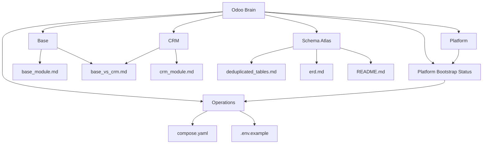

# Odoo Brain

This vault organizes the Odoo 19 documentation as an Obsidian-style knowledge graph.

## Entry points
- [Platform](brain/platform.md)
- [Platform Bootstrap Status](brain/platform_bootstrap_status.md)
- [Base](brain/base.md)
- [CRM](brain/crm.md)
- [Schema Atlas](brain/schema.md)
- [Operations](brain/operations.md)

## Graph

## How to use this brain
- Open the vault from the `docs/` directory in Obsidian.
- Start with the platform note if you want the stack overview.
- Use the base and CRM notes when changing models, relations, or constraints.
- Use the schema atlas when you need table-level navigation or ERDs.

## Quick links
- [Odoo schema README](odoo19_schema/README.md)
- [Platform bootstrap doc](architecture/platform-bootstrap.md)
- [Backup and restore runbook](runbooks/backup-and-restore.md)
- [Base module doc](odoo19_schema/base_module.md)
- [CRM module doc](odoo19_schema/crm_module.md)
- [Base vs CRM comparison](odoo19_schema/base_vs_crm.md)
