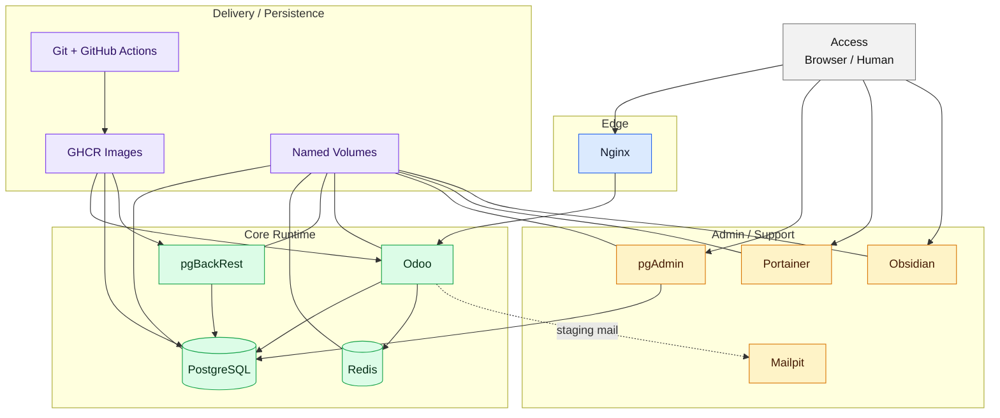

# Architecture Overview

## Purpose
One-page summary of the platform as a Git-backed, Odoo.sh-style stack.

## Current platform contract

This is the part that stays stable while the future control plane grows around it.

| Layer | Summary |
| --- | --- |
| Edge | Nginx stays in front of Odoo. |
| Core runtime | db, redis, pgBackRest, and Odoo stay private and separate from any control plane. |
| Admin / support | pgAdmin, Portainer, Obsidian, and Mailpit stay local or staging support. |
| Delivery | Git, CI/CD, GHCR, env files, and named volumes are the deployment base. |

For the next system slice, see [Future Control Plane](future_control_plane.md).

## The shape

## Five layers

### Access
- browser entry points for users and admins

### Edge
- `nginx` forwards browser traffic to Odoo

### Core runtime
- `db`, `redis`, `pgbackrest`, `odoo`

### Admin and support
- `pgadmin`, `portainer`, `obsidian`, `mailpit`

### Delivery and persistence
- Git, GitHub Actions, GHCR, env files, named volumes

## One-line mental model

- access comes in through the browser
- edge routes traffic to the app
- core services run privately on `odoo_net`
- admin tools stay local-only
- delivery comes from Git, not from manual UI edits

## Quick read

- browser -> nginx -> odoo -> db/redis
- pgbackrest reads the database and backup volumes
- pgadmin inspects the database
- portainer inspects and manages containers
- obsidian holds the docs vault
- mailpit catches staging mail
- Git + CI/CD + GHCR move the platform forward

## Rules

- do not expose internal services unless there is a real reason
- keep `pgadmin`, `obsidian`, and `portainer` local/admin-only
- keep `mailpit` loopback-only in staging
- use Git and environment files for durable changes
- use Portainer for operations, not as the only source of truth

## Related notes
- [Platform](platform.md)
- [Platform Bootstrap Status](platform_bootstrap_status.md)
- [Stack Topology](stack_topology.md)
- [Delivery](delivery.md)
- [Future Control Plane](future_control_plane.md)
- [Service Map](../architecture/service-map.md)
- [Portainer Workflow](portainer_workflow.md)