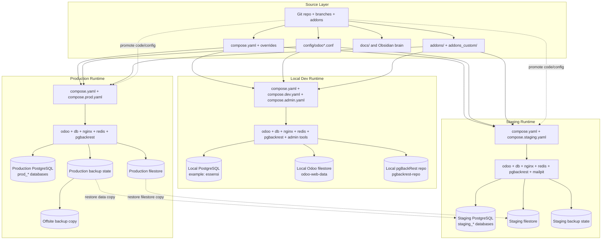

# Environment State Model

## Purpose

This note explains the boundary between Git, Docker runtime, live Odoo state, and backups.

Use it when the stack feels confusing and you need to answer:

- what lives in the repository
- what lives in containers
- what lives in PostgreSQL or the filestore
- what gets promoted by Git
- what gets restored from backups

## Core rule

This platform is easier to reason about if you split it into four layers:

- source layer
- runtime layer
- live state layer
- backup layer

## Current local example

Right now this workspace is running a local dev-shaped stack:

- `compose.yaml` + `compose.dev.yaml`
- optional admin layer from `compose.admin.yaml`
- current local PostgreSQL database: `essensi`

That means your browser is talking to a dev runtime, not to staging or production.

## What lives where

### Source layer

Git is the source of truth for:

- compose files
- `config/odoo*.conf`
- docs
- scripts
- `addons/`
- `addons_custom/`

### Runtime layer

Docker turns that source into running services:

- `db`
- `odoo`
- `nginx`
- `redis`
- `pgbackrest`
- optional admin services

### Live state layer

The real ERP state lives outside Git:

- PostgreSQL data
- Odoo filestore
- installed module state
- users and business data
- admin UI saved state

### Backup layer

Backups protect the live state layer:

- PostgreSQL backups through `pgbackrest`
- filestore archives
- optional offsite copies

## Promotion rule

Git promotion moves code and configuration between environments.

It does not automatically move:

- databases
- filestore
- installed module state
- user-created records

That is why a module can exist in Git and still be uninstalled in a database.

## Visual model

## Practical examples

### Example 1: custom module

If `addons_custom/ss_enterprise_theme` exists in Git:

- the code can be deployed to dev, staging, and prod
- Odoo can see it as a module on disk
- each database still decides separately whether that module is installed

### Example 2: local database

If you create a company, contact, or invoice in `essensi`:

- that change is not stored in Git
- it is stored in PostgreSQL and possibly the filestore
- a backup can recover it
- a Git checkout cannot recover it by itself

### Example 3: staging restore

When staging is rebuilt from production:

- Git still provides the code and config shape
- backup artifacts provide the production-like data copy
- staging neutralization makes that restored copy safe to use

## Related notes

- [Platform](platform.md)
- [Delivery](delivery.md)
- [Stack Topology](stack_topology.md)
- [Operations](operations.md)
- [Platform Bootstrap Status](platform_bootstrap_status.md)
- [Environments and Promotions](../runbooks/environments-and-promotions.md)
- [Deployment Over SSH](../runbooks/deployment-over-ssh.md)
- [Backup and Restore Runbook](../runbooks/backup-and-restore.md)
