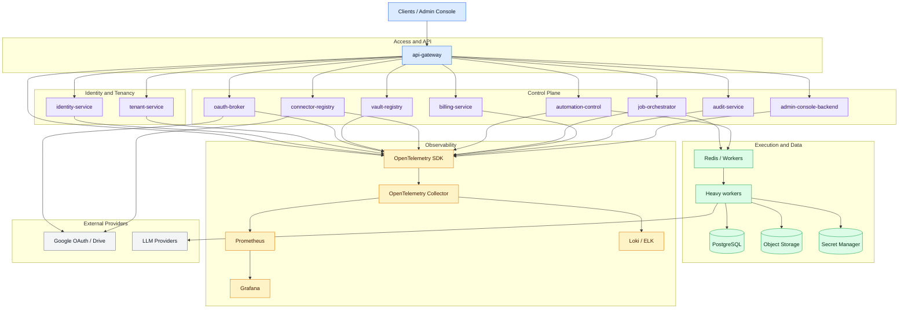

# Future Control Plane

## Purpose
Record the next architecture slice for a multi-tenant platform: queueing, observability, OAuth brokerage, and metadata registries.

This note is intentionally separate from the current Odoo stack so the present platform stays clean while the future shape stays documented.

## What stays in the current platform

These boundaries do not move when the future control plane is added.

| Layer | What stays there |
| --- | --- |
| Edge | Nginx in front of Odoo stays as the browser entrypoint |
| Core runtime | db, redis, pgBackRest, and Odoo remain the private runtime core |
| Admin / support | pgAdmin, Portainer, Obsidian, and Mailpit remain local or staging support |
| Delivery | Git, CI/CD, GHCR, env files, and named volumes become the formal delivery base |

## Control plane new

This does not exist yet as a separate system. It is the next layer we would build around the current platform.

### Logical services
- api-gateway
- identity-service
- tenant-service
- oauth-broker
- vault-registry
- connector-registry
- automation-control
- job-orchestrator
- billing-service
- audit-service
- admin-console-backend

### What belongs here
- auth and session entrypoints
- tenant-aware routing and policy
- connector and vault metadata
- automation control and orchestration
- billing and audit trails
- admin console backend APIs

### What does not belong here
- raw vault content
- heavy worker execution
- direct database-heavy sync jobs
- agent runtime execution
- local UI-only state

## Visual model

## 8. Queue

The queue decouples response time from heavy work.

### What goes to the queue
- document ingestion
- Google Drive synchronization
- email summarization
- embedding generation
- index regeneration
- automation execution
- agent runtime launch
- temporary resource cleanup

### Why it is critical
- reduces API latency
- protects UX
- lowers timeout risk
- prevents peak-hour collapse

### Typical stack
- start with Redis plus workers
- move to RabbitMQ, NATS, or Kafka if the workload grows and the pattern demands it

### Queue rules
- separate queues by priority
- enforce tenant limits
- deduplicate jobs
- use idempotency keys
- keep a dead-letter queue
- trace job to worker to result

## 8.1 Heavy execution

Heavy execution should not live inline in the API.

That includes:
- queue consumers
- ingestion workers
- sync workers
- embedding jobs
- automation runners
- agent runtimes

### Execution rules
- keep the API fast and stateless
- move long-running work to workers
- split workloads by tenant and priority
- isolate retries and failures from the request path
- store job state in durable persistence, not in memory only

## 9. Observability

Observability means understanding the system end to end, not just storing logs.

### Signals to collect
- traces
- metrics
- structured logs

### Trace path to follow
- HTTP request
- backend call
- database access
- enqueue step
- worker execution
- external API call
- persistence of the result

### Metrics to track
- p50 / p95 / p99 latency
- error rate
- jobs per minute
- failed jobs
- tenant usage
- OAuth failures
- queue backlog
- LLM token consumption
- storage by tenant

### Logging rules
- JSON logs only
- include `tenant_id`, `user_id`, `request_id`, and `trace_id`
- never log secrets
- avoid unnecessary personal data

### Suggested stack
- OpenTelemetry SDK in services
- OpenTelemetry Collector
- Prometheus for metrics
- Loki or ELK for logs
- Grafana for dashboards
- alerts tied to SLOs

### Minimum alerts
- unusual OAuth error spike
- high queue backlog
- API latency degradation
- database failures
- dead workers
- refresh token failures
- tenant quota abuse

## 10. OAuth broker for Google

The broker is not just login with Google.

It handles:
- consent
- scopes
- authorization code exchange
- encrypted refresh token storage
- access token refresh
- revocation
- Google account to user or tenant mapping
- consent audit trail

### Required behavior
- support multiple Google accounts per user if needed
- support multiple connectors under one identity provider
- support incremental scopes
- support re-consent when permissions change
- support clean revocation
- handle token expiry properly

### Security rules
- encrypt tokens at rest
- never send refresh tokens to the frontend
- validate tokens on the backend
- use exact and secure redirect URIs
- request only the minimum scopes required
- rotate internal keys

### Suggested broker model
- `oauth_clients`
- `oauth_accounts`
- `oauth_grants`
- `oauth_tokens`
- `oauth_scopes`
- `oauth_events`

### Suggested internal APIs
- `startConsent(connector, tenant, user)`
- `handleCallback(provider, code, state)`
- `refreshAccessToken(account_id)`
- `revokeGrant(account_id)`
- `getScopedCredential(account_id, scope_set)`

## 11. Metadata for vaults, connectors, agents, and automations

This is control-plane metadata, not raw content.

### Vault metadata
- name
- owner tenant
- size
- state
- last indexed date
- schema version
- retention policy

### Connector metadata
- connector type
- state
- last sync
- granted scopes
- recent errors
- health

### Agent metadata
- agent configuration
- allowed tools
- default model
- execution limits
- runtime policy
- summary of recent sessions

### Automation metadata
- trigger
- schedule
- state
- last runs
- retries
- destination for results

### Why split metadata from content
- the control plane needs to know what exists
- it needs to know whether things are healthy
- it needs to govern the system without loading all raw content every time

## 11.1 Persistence

The current Odoo platform uses named volumes for persistence. The future control plane should keep durable state outside the API process and out of worker memory.

### Persistence targets
- PostgreSQL for durable relational state
- Redis for queue state and transient coordination
- object storage for files, exports, artifacts, and large blobs
- secret manager for encrypted credentials and tokens
- metadata registries for catalog state about vaults, connectors, agents, and automations

### Persistence rules
- do not keep durable state only in memory
- do not treat the API service as the source of truth
- keep raw content separate from control metadata when possible
- keep tenant-aware data boundaries explicit
- use named volumes only for the current Odoo platform, not as the long-term design for this control plane

## Control plane shape

### Logical services
- api-gateway
- identity-service
- tenant-service
- oauth-broker
- vault-registry
- connector-registry
- automation-control
- job-orchestrator
- billing-service
- audit-service
- admin-console-backend

### Principles
- stateless application services
- tenant-aware data model
- idempotent workflows
- least privilege everywhere
- end-to-end tracing
- separation between control and execution
- feature flags and quotas from the start

### What stays outside this layer
- raw vault storage
- heavy agent runtimes
- heavy sync or ingestion workers
- local embedding storage inside the API pod
- scattered secrets in env vars only

## Scaling model

### What scales horizontally
- API services
- auth and tenant services
- workers
- observability collector

### What scales separately
- PostgreSQL
- Redis
- object storage
- secret manager

## Summary

If this future layer becomes real, the platform should behave like:

- shared multi-tenant control plane
- isolated execution workers
- external durable persistence
- full observability
- Git-backed delivery

## Related notes
- [Architecture Overview](architecture_overview.md)
- [Stack Topology](stack_topology.md)
- [Delivery](delivery.md)
- [Service Map](../architecture/service-map.md)