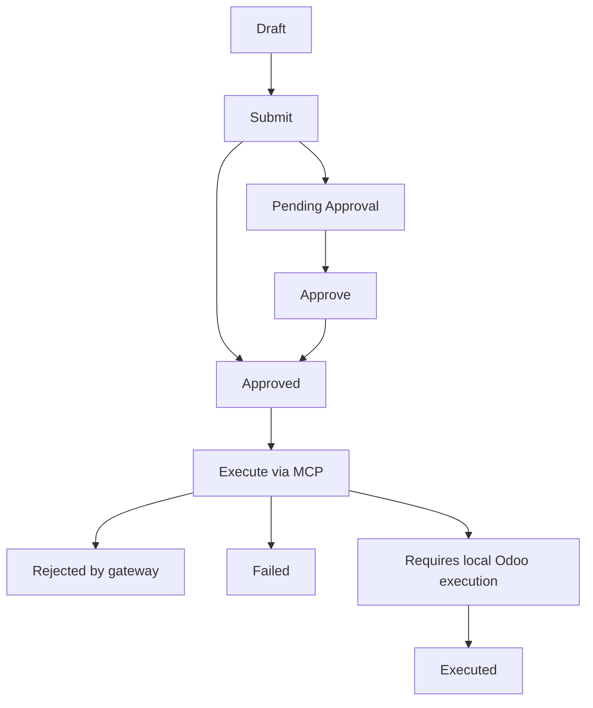

# OpenClaw Request Cycle

## Goal

This note documents the full lifecycle of an OpenClaw request, from the first action in Odoo to the final execution result returned by the control-plane gateway.

## Actors

- Odoo user or operator.
- OpenClaw Odoo addon in [addons_custom/openclaw/](../../addons_custom/openclaw/).
- Control-plane MCP gateway in [control-plane/app/mcp_gateway.py](../../control-plane/app/mcp_gateway.py).
- PostgreSQL database used by Odoo.
- Obsidian vault at `docs/` for documentation-backed actions.

## Request lifecycle

1. A user creates an [openclaw.request](../../addons_custom/openclaw/models/openclaw_request.py) record in Odoo.
2. The request is associated with an [openclaw.policy](../../addons_custom/openclaw/models/openclaw_policy.py) record.
3. Odoo snapshots the policy and copies the allowlist into the request record.
4. The user submits the request.
5. If the policy requires approval, the state changes to `pending`.
6. If approval is not required, the request is auto-approved.
7. An approved request is executed from Odoo by calling the MCP gateway tool `openclaw.execute_request`.
8. The gateway validates the request against the policy allowlist and policy booleans.
9. The gateway either rejects the request, asks for local Odoo execution, or executes another tool.
10. If the gateway returns a `requires_local_execution` response, Odoo performs the ORM action locally.
11. Odoo stores the gateway response, the local result if any, and the final request state.
12. The result stays visible in the request record for audit and review.

## State flow

## What Odoo stores

The request record keeps the following trace data:

- instruction text
- policy association
- policy snapshot JSON
- copied tool allowlist
- payload JSON
- chosen action type
- custom tool name when needed
- gateway tool name
- gateway response JSON
- decision note
- result summary
- error message
- timestamps for submit, approve, execute, and fail

## Gateway behavior

The gateway code in [control-plane/app/mcp_gateway.py](../../control-plane/app/mcp_gateway.py) handles the request in this order:

1. Accepts a JSON-RPC call to `tools/call`.
2. Dispatches `openclaw.execute_request`.
3. Checks the request allowlist and policy flags.
4. Normalizes the action name.
5. Returns one of these shapes:
   - `rejected`
   - `requires_local_execution`
   - `completed`
   - `failed`

## Local Odoo execution path

When the gateway returns `requires_local_execution`:

- Odoo reads the returned `local_action` structure.
- The addon executes ORM operations such as `search_read`, `search`, `create`, `write`, `unlink`, or `method`.
- The local result is folded back into the gateway response.
- The request is marked `executed`.

## Failure handling

There are four main failure points:

- invalid request payload
- policy rejection
- gateway error
- local Odoo execution error

When failure happens, Odoo stores the failure state and the error message so the operator can inspect what happened later.

## What this cycle is for

This workflow exists so risky work is not executed directly from chat or from a raw script. The request record becomes the approval envelope, the gateway becomes the policy gate, and Odoo remains the system of record.

## Related notes

- [OpenClaw](openclaw.md)
- [OpenClaw Control Plane](control_plane.md)
- [OpenClaw Tool Catalog](openclaw_tools.md)
- [OpenClaw Request Templates](openclaw_templates.md)