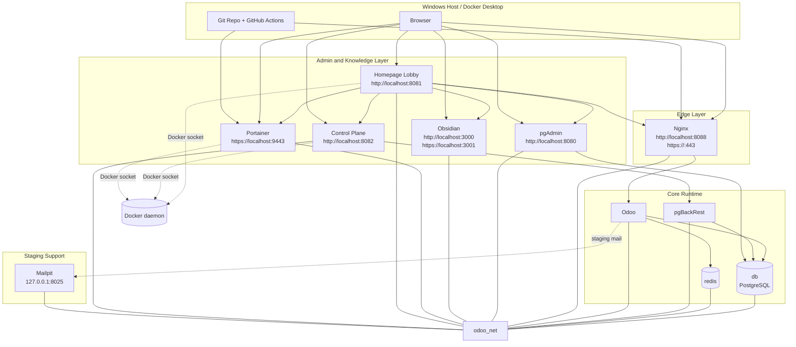

# Stack Topology

## Purpose
This note shows how the platform services connect, which ones are internal, which ones are exposed, and how to use each layer.

For per-service detail, use [Service Map](../architecture/service-map.md).

## Network model
All containers are attached to the shared `odoo_net` bridge network.

That means:

- containers resolve each other by compose service name
- internal services stay private unless a port is explicitly published
- browser access happens only through the services that publish host ports

## Delivery model

This stack should be treated as a Git-backed delivery pipeline, not just a local compose project.

That means:

- source lives in the repository
- CI/CD publishes immutable images
- environments are separated into development, staging, and production
- Portainer is for operations, not the canonical source of truth

## Persistence model

Named volumes are the state boundary for the stack.

Current persistent volumes:

- `postgres-data`
- `postgres-run`
- `pgbackrest-repo`
- `redis-data`
- `odoo-web-data`
- `pgadmin-data`
- `obsidian-config`
- `portainer-data`

Rule of thumb:

- if a change must survive restarts, it should be stored in Git, an environment file, or a named volume
- if a change is only operational, Portainer can display it, but it should not be the only record of truth

## Visual map

## Layer summary

- edge: nginx is the browser entrypoint for Odoo
- core runtime: db, redis, pgBackRest, and Odoo stay private on `odoo_net`
- admin and support: Homepage lobby, pgAdmin, Portainer, Obsidian, and Mailpit stay optional and local or staging oriented
- delivery and persistence: Git, GitHub Actions, GHCR, env files, and named volumes define repeatable deployment

## When to use this note

- when you want the visual map of the stack
- when you want to know which layer is internal or exposed
- when you want the ownership boundaries between runtime, admin tools, and delivery
- when you need the bridge into the future control plane without reading service-level detail

## Recommended use

- use the Homepage lobby at `http://localhost:8081` as the first click, it links to every other UI and shows live container status
- expect Homepage web checks to come from inside Docker, not from host `localhost`; Nginx is monitored through `http://nginx/healthz`
- use Portainer for container visibility and simple lifecycle actions
- use pgAdmin for database inspection and emergency admin tasks
- use Obsidian for documentation and operational notes
- use Odoo through Nginx for normal app access
- use `docker compose` and the repository files as the source of truth for repeatable infrastructure changes
- use GitHub Actions and GHCR for delivery and immutable image promotion

## File and environment boundaries

- compose files define the runtime shape
- environment files define runtime values
- named volumes define persistent state
- Portainer defines the operational view of the stack
- Git defines the delivery path and canonical revision history

## Related future work

- [Future Control Plane](future_control_plane.md)

## Related notes
- [Odoo Brain](../00_Odoo_Brain.md)
- [Platform](platform.md)
- [Environment State Model](environment_state_model.md)
- [Platform Bootstrap Status](platform_bootstrap_status.md)
- [Delivery](delivery.md)
- [Services](services.md)
- [Portainer](portainer.md)
- [Lobby](lobby.md)
- [Control Plane](control_plane.md)
- [Operations](operations.md)
